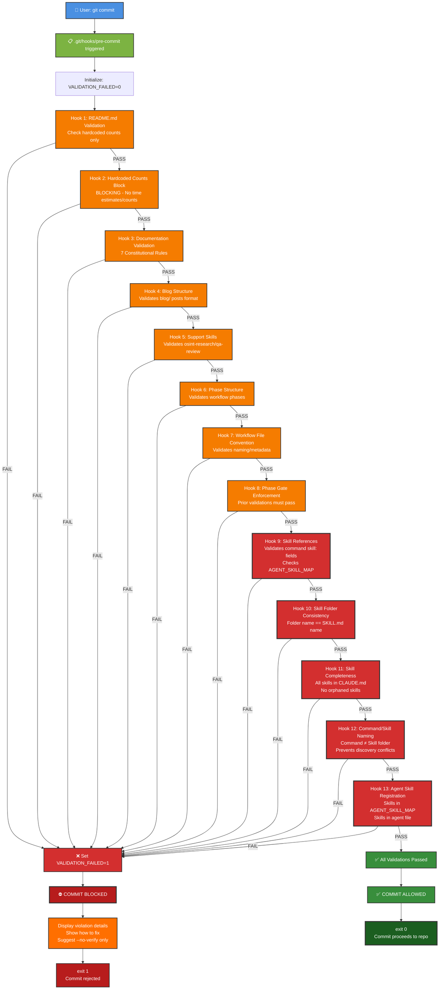

```mermaid
graph TD
    A["🚀 User: git commit"] --> B["📋 .git/hooks/pre-commit triggered"]

    B --> C["Initialize: VALIDATION_FAILED=0"]
    C --> H1["Hook 1: README.md Validation<br/>Check hardcoded counts only"]

    H1 -->|PASS| H2["Hook 2: Hardcoded Counts Block<br/>BLOCKING - No time estimates/counts"]
    H1 -->|FAIL| FAIL["❌ Set VALIDATION_FAILED=1"]

    H2 -->|PASS| H3["Hook 3: Documentation Validation<br/>7 Constitutional Rules"]
    H2 -->|FAIL| FAIL

    H3 -->|PASS| H4["Hook 4: Blog Structure<br/>Validates blog/ posts format"]
    H3 -->|FAIL| FAIL

    H4 -->|PASS| H5["Hook 5: Support Skills<br/>Validates osint-research/qa-review"]
    H4 -->|FAIL| FAIL

    H5 -->|PASS| H6["Hook 6: Phase Structure<br/>Validates workflow phases"]
    H5 -->|FAIL| FAIL

    H6 -->|PASS| H7["Hook 7: Workflow File Convention<br/>Validates naming/metadata"]
    H6 -->|FAIL| FAIL

    H7 -->|PASS| H8["Hook 8: Phase Gate Enforcement<br/>Prior validations must pass"]
    H7 -->|FAIL| FAIL

    H8 -->|PASS| H9["Hook 9: Skill References<br/>Validates command skill: fields<br/>Checks AGENT_SKILL_MAP"]
    H8 -->|FAIL| FAIL

    H9 -->|PASS| H10["Hook 10: Skill Folder Consistency<br/>Folder name == SKILL.md name"]
    H9 -->|FAIL| FAIL

    H10 -->|PASS| H11["Hook 11: Skill Completeness<br/>All skills in CLAUDE.md<br/>No orphaned skills"]
    H10 -->|FAIL| FAIL

    H11 -->|PASS| H12["Hook 12: Command/Skill Naming<br/>Command ≠ Skill folder<br/>Prevents discovery conflicts"]
    H11 -->|FAIL| FAIL

    H12 -->|PASS| H13["Hook 13: Agent Skill Registration<br/>Skills in AGENT_SKILL_MAP<br/>Skills in agent file"]
    H12 -->|FAIL| FAIL

    H13 -->|PASS| SUCCESS["✅ All Validations Passed"]
    H13 -->|FAIL| FAIL

    FAIL --> ERROR["⛔ COMMIT BLOCKED"]
    ERROR --> ERRORMSG["Display violation details<br/>Show how to fix<br/>Suggest --no-verify only"]
    ERRORMSG --> EXIT1["exit 1<br/>Commit rejected"]

    SUCCESS --> EXIT0["✅ COMMIT ALLOWED"]
    EXIT0 --> PROCEED["exit 0<br/>Commit proceeds to repo"]

    style A fill:#4a90e2,stroke:#333,stroke-width:2px,color:#fff
    style B fill:#7cb342,stroke:#333,stroke-width:2px,color:#fff
    style H1 fill:#f57c00,stroke:#333,stroke-width:2px,color:#fff
    style H2 fill:#f57c00,stroke:#333,stroke-width:2px,color:#fff
    style H3 fill:#f57c00,stroke:#333,stroke-width:2px,color:#fff
    style H4 fill:#f57c00,stroke:#333,stroke-width:2px,color:#fff
    style H5 fill:#f57c00,stroke:#333,stroke-width:2px,color:#fff
    style H6 fill:#f57c00,stroke:#333,stroke-width:2px,color:#fff
    style H7 fill:#f57c00,stroke:#333,stroke-width:2px,color:#fff
    style H8 fill:#f57c00,stroke:#333,stroke-width:2px,color:#fff
    style H9 fill:#d32f2f,stroke:#333,stroke-width:3px,color:#fff
    style H10 fill:#d32f2f,stroke:#333,stroke-width:3px,color:#fff
    style H11 fill:#d32f2f,stroke:#333,stroke-width:3px,color:#fff
    style H12 fill:#d32f2f,stroke:#333,stroke-width:3px,color:#fff
    style H13 fill:#d32f2f,stroke:#333,stroke-width:3px,color:#fff
    style FAIL fill:#d32f2f,stroke:#333,stroke-width:2px,color:#fff
    style ERROR fill:#b71c1c,stroke:#333,stroke-width:3px,color:#fff
    style ERRORMSG fill:#ff6f00,stroke:#333,stroke-width:2px,color:#fff
    style EXIT1 fill:#b71c1c,stroke:#333,stroke-width:2px,color:#fff
    style SUCCESS fill:#388e3c,stroke:#333,stroke-width:2px,color:#fff
    style EXIT0 fill:#388e3c,stroke:#333,stroke-width:2px,color:#fff
    style PROCEED fill:#1b5e20,stroke:#333,stroke-width:3px,color:#fff
```
