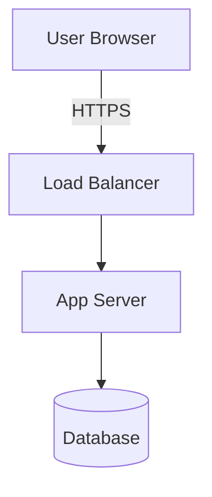
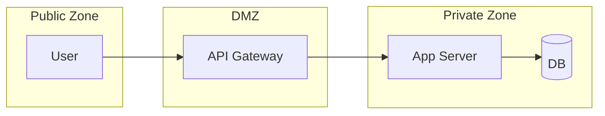
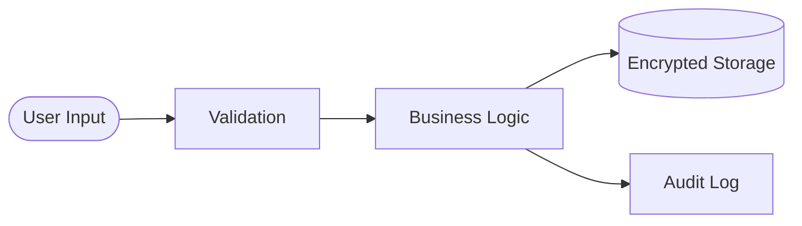
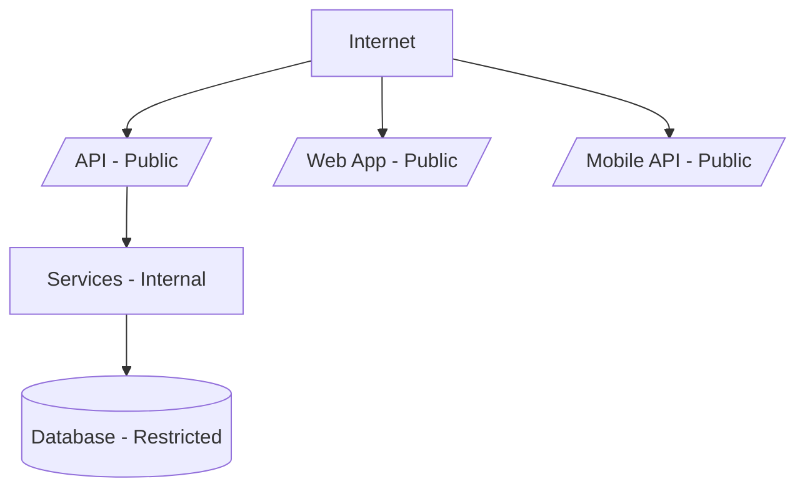
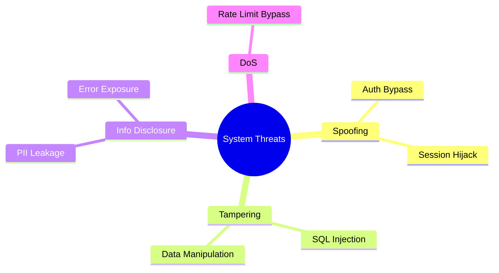
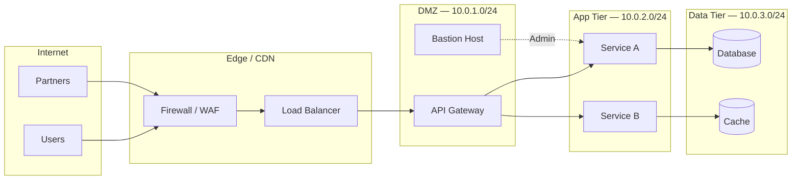

# Phase 4: DOCUMENT (Reports and Diagrams)

## IDENTITY

**Agent:** `agents/security.md` (loaded automatically from METADATA `agent:` field)

**Phase-specific role:** Compile all analysis and recommendations into professional deliverables.
Create executive summary, generate Mermaid diagrams, assemble complete report, and create
metadata.json.

**Additional constraints:** No placeholder text (TODO, TBD). All recommendations must have
priority. Framework references must be accurate. Professional formatting throughout. No hardcoded
counts or time estimates. All 6 diagrams must be attempted.

---

## INPUT CONTRACT

**Receives:**
- Recommendations file from Phase 3
- Analysis files from Phase 2
- Scope from Phase 1
- Domain selection (A always; B/C/E if selected)
- Output directory: `private/output/sec-review/{project}-{date}/`

**Prerequisites:**
- Phase 3 (RECOMMEND) completed
- Recommendations documented with P0-P3 priorities
- All analysis files created in Phase 2

**Source:** `skills/sec-review/phases/03-recommend.md`

---

## OBJECTIVE

**Goal:** Create complete, professional deliverables including diagrams, a consolidated report,
and metadata.

**Success criteria:**
- Executive summary created
- All domain-specific deliverable files complete
- Mermaid diagrams generated (6 diagrams, .mmd always, .svg/.png best effort)
- FULL-REPORT.md consolidates all files without duplication
- metadata.json created
- No placeholder content in any file
- Professional formatting verified

**Failure criteria:**
- Report contains TODO/TBD markers → Fix before completing
- Missing deliverable files → Create all required files
- Diagram directory missing → Create diagrams/ and attempt rendering

---

## METHODOLOGY

**Phase 4 is about assembly and polish.** The analytical work is done. This phase compiles
existing outputs into a cohesive, professional package.

**Diagrams communicate what text cannot.** Architecture diagrams, trust boundary maps, and
threat models are the most-cited sections of security review deliverables. Generate all six
from the analysis content produced in Phase 2.

**The full report is the primary deliverable.** It consolidates all files without duplication.
A stakeholder should get the full picture from FULL-REPORT.md alone.

---

## EXECUTION

### Step 1: Create Executive Summary

**Tool:** Write

Create executive summary as the first deliverable:

```markdown
# Executive Summary

## Engagement Overview
- **Type:** Security Review
- **Date:** YYYY-MM-DD
- **Scope:** [Brief scope description]
- **Domains Assessed:** Architecture & Environment[, Security Practices][, Patch Management]

## Key Findings
- [Architecture threat count] architecture threats identified
- [Top concern summary]
- [Security practice gaps — Domain B, if included]
- [Patch management maturity — Domain C, if included]

## Risk Assessment
[Overall security posture assessment — 2-3 sentences]

## Top Recommendations
1. [Most critical recommendation — P0]
2. [Second priority — P0/P1]
3. [Third priority — P1]

## Next Steps
- [Immediate action 1]
- [Immediate action 2]
```

**Expected output:** EXECUTIVE-SUMMARY.md written
**On failure:** If findings incomplete, return to Phase 3

### Step 2: Compile Deliverable Files

**Tool:** Write, Read (to verify existing files)

Verify all required files exist. Create any that are missing:

**Required for all invocations:**
```
findings/                     (from Phase 2 — per-finding directories)
  F001-{slug}/
    finding.md                (complete triage-ready finding)
    screenshots/              (evidence for this finding)
EXECUTIVE-SUMMARY.md          (Step 1)
ARCHITECTURE-ANALYSIS.md      (from Phase 2)
THREAT-MODEL.md               (from Phase 2)
FINDINGS.md                   (from Phase 2 — consolidated from per-finding files)
GAP-ANALYSIS.md               (from Phase 3)
RECOMMENDATIONS.md            (from Phase 3)
```

**Domain B (if selected):**
```
PRACTICES-REVIEW.md           (from Phase 2)
```

**Domain C (if selected):**
```
PATCH-ASSESSMENT.md           (from Phase 2)
```

**Domain E (if selected):**
```
SUPPLY-CHAIN-REVIEW.md        (from Phase 2)
```

**Expected output:** All required files confirmed present
**On failure:** If source file missing, return to the appropriate phase

### Step 2.5: Generate Mermaid Diagrams

**Tool:** Write (.mmd files), mermaid tool (render.ts)

Generate six diagrams from the Phase 2 analysis content. Create the `diagrams/` subdirectory
in the output directory.

**CRITICAL — node label line breaks:** Always use `<br/>` for multi-line node labels.
Never use `\n` — mmdc renders it as the literal two characters `\n`, not a line break.

```
CORRECT:   WAF["Fortinet WAF<br/>MPP Only"]
INCORRECT: WAF["Fortinet WAF\nMPP Only"]
```

**For each diagram:**

1. Construct Mermaid syntax from analysis content — use `<br/>` for all line breaks in labels
2. Write `.mmd` file to `{output-dir}/diagrams/`
3. Render via mmdc (run from the output directory):
   ```bash
   # Run from: private/output/sec-review/{project}-{date}/
   bun x mmdc -i diagrams/{name}.mmd -o diagrams/{name}.svg
   # Optionally render PNG
   bun x mmdc -i diagrams/{name}.mmd -o diagrams/{name}.png
   ```
4. Embed SVG in QMD sections (NOT as mermaid code blocks):
   ```markdown
   
   ```
5. If rendering fails: write `.mmd` only, note in FULL-REPORT.md

**The 6 required diagrams:**

| # | Diagram | Type | Output Name |
|---|---------|------|-------------|
| 1 | Architecture Overview | `graph TD` | `arch-overview` |
| 2 | Trust Boundaries | `graph LR` with subgraphs | `trust-boundaries` |
| 3 | Data Flow | `flowchart LR` | `data-flow` |
| 4 | Attack Surface | `graph TD` | `attack-surface` |
| 5 | Threat Model | `mindmap` or `graph TD` | `threat-model` |
| 6 | Network Topology | `graph LR` | `network-topology` |

**Mermaid syntax guidance:**

**Critical: Use `<br/>` for line breaks in node labels.** The Mermaid CLI (mmdc) does not convert `\n` to line breaks — you must use `<br/>` explicitly. For example: `A["Click here<br/>to continue"]` not `A["Click here\nto continue"]`.

Architecture Overview — show components and their connections:


Trust Boundaries — use subgraphs to delineate zones:


Data Flow — trace sensitive data paths:


Attack Surface — enumerate entry points with exposure levels:


Threat Model — visualize threats and affected components:


Network Topology — physical/logical network with subnets, routing, and firewall placement:


Network Topology should reflect actual subnet ranges, VLAN boundaries, and firewall placement
from the architecture documentation. If subnet details are unavailable, use logical tier names.

**Expected output:** `diagrams/` directory with .mmd files (always), .svg and .png (best effort)
**On failure:** Write .mmd files only, note in FULL-REPORT.md that rendering was unavailable

### Step 3: Assemble Full Report

**Tool:** Read (template + source files), Write

Read the assembly manifest: `tools/quarto/templates/reports/sec_review/sec_review-report.qmd`

Follow the mode-specific assembly order from the template. The template defines which sections
to extract from which files and deduplication rules.

**Assembly process:**
1. Read assembly manifest
2. Verify all source files exist in output directory
3. Read each source file listed in the section map
4. Extract content per assembly instructions
5. Apply deduplication rules (severity tables, stats, compliance mappings appear once)
6. Include diagram references in appropriate sections
7. Include GAP-ANALYSIS.md content between the Recommendations and Appendix sections.
   Label it "Gap Analysis" in the Table of Contents.
8. Generate Table of Contents from section headings
9. Apply formatting rules (100-char width, h2 sections, no emoji in headings)
10. Write FULL-REPORT.md to output directory

**Expected output:** FULL-REPORT.md written to output directory
**On failure:** If source files incomplete, return to Step 2

### Step 4: Create Metadata

**Tool:** Write

Create `metadata.json`:

```json
{
  "engagement_type": "sec-review",
  "mode": "sec-review",
  "project": "[project name]",
  "date": "YYYY-MM-DD",
  "scope": "[scope description]",
  "findings": {
    "critical": 0,
    "high": 0,
    "medium": 0,
    "low": 0
  },
  "diagrams": {
    "generated": ["arch-overview", "trust-boundaries", "data-flow", "attack-surface",
                  "threat-model", "network-topology"],
    "formats": ["mmd", "svg", "png"]
  },
  "domains": {
    "A": true,
    "B": false,
    "C": false,
    "E": false
  },
  "status": "complete",
  "deliverables": {
    "files": [
      "EXECUTIVE-SUMMARY.md",
      "ARCHITECTURE-ANALYSIS.md",
      "THREAT-MODEL.md",
      "FINDINGS.md",
      "GAP-ANALYSIS.md",
      "RECOMMENDATIONS.md",
      "FULL-REPORT.md",
      "metadata.json"
    ]
  }
}
```

Include PRACTICES-REVIEW.md and PATCH-ASSESSMENT.md in deliverables if generated.
Include SUPPLY-CHAIN-REVIEW.md if generated. Set domains.E to true if selected.
List only diagram formats that were successfully rendered.

**Expected output:** metadata.json written to output directory
**On failure:** If finding counts unknown, count from FINDINGS.md

### Step 5: Quality Check

**Tool:** Read (to verify each file)

Before finalizing, verify all deliverables:

- [ ] No placeholder text (TODO, TBD, etc.)
- [ ] All recommendations have priority (P0-P3)
- [ ] Framework references accurate
- [ ] No hardcoded counts or time estimates
- [ ] Professional formatting throughout
- [ ] All required files present
- [ ] Diagrams directory exists with at least .mmd files
- [ ] FULL-REPORT.md consolidates all files without duplication
- [ ] metadata.json accurate and includes FULL-REPORT.md
- [ ] diagram references in FULL-REPORT.md are accurate
- [ ] GAP-ANALYSIS.md present with current vs target state populated for all selected domains
- [ ] Network topology diagram attempted (diagrams/network-topology.mmd exists)
- [ ] Domain E file present if Domain E was selected

**Expected output:** Quality check passed
**On failure:** Fix identified issues before proceeding

### Step 6: Generate Styled HTML Report

**Tool:** Bash

Run the bridge script to produce the branded HTML deliverable:

```bash
bun skills/sec-review/scripts/markdown-bridge.ts \
  --output-dir private/output/sec-review/{project}-{YYYY-MM-DD}/
```

Replace `{project}-{YYYY-MM-DD}` with the actual output directory name.

**On success:** `sec-review-report.html` appears in the output directory. Include its path in the deliverables summary presented in Phase 5.
**On failure:** Log the error and continue — markdown deliverables are complete. HTML is additive; do not block Phase 5.

**One-off finding report:** To generate a standalone HTML for a single finding:
```bash
bun skills/sec-review/scripts/markdown-bridge.ts \
  --finding private/output/sec-review/{project}-{date}/findings/F001-{slug}/
```
This produces `F001-{slug}/finding-report.html`. Re-run after customer adds remediation
evidence or updates STATUS to "Remediated" to generate an updated clean report.

---

## OUTPUT CONTRACT

**Produces:**
- `EXECUTIVE-SUMMARY.md` → `private/output/sec-review/{project}-{date}/`
- `FULL-REPORT.md` → `private/output/sec-review/{project}-{date}/`
- `metadata.json` → `private/output/sec-review/{project}-{date}/`
- `sec-review-report.html` → `private/output/sec-review/{project}-{date}/sec-review-report.html` (branded HTML, auto-generated)
- `diagrams/*.mmd` → `private/output/sec-review/{project}-{date}/diagrams/`
- `diagrams/network-topology.mmd` → `private/output/sec-review/{project}-{date}/diagrams/`
- `diagrams/*.svg` → `private/output/sec-review/{project}-{date}/diagrams/` (best effort)
- `diagrams/*.png` → `private/output/sec-review/{project}-{date}/diagrams/` (best effort)
- GAP-ANALYSIS.md references included in FULL-REPORT.md

**Format:** Professional markdown reports, JSON metadata, branded HTML, Mermaid diagram files

---

## NEXT

**On success:** → Proceed to Phase 5 (Deliver):

Load `skills/sec-review/phases/05-deliver.md` with:
- All deliverable files in output directory
- Domain selection and project information
- metadata.json content
- Diagram inventory

**On quality check failure:** → Fix issues within this phase, do not advance

**On missing source files:** → Return to the appropriate earlier phase

---

## CHECKPOINTS

**Exit criteria (ALL must be true):**
- [ ] Executive summary created
- [ ] All selected domain deliverable files complete
- [ ] Diagrams directory created with at least 6 .mmd files
- [ ] FULL-REPORT.md consolidates all files without duplication
- [ ] GAP-ANALYSIS.md included in FULL-REPORT.md assembly
- [ ] metadata.json created
- [ ] No placeholder content in any file
- [ ] Quality check passed (Step 5)
- [ ] HTML report generation attempted (Step 6) — success or graceful failure
- [ ] All files in correct output directory
- [ ] Ready to proceed to Phase 5 (DELIVER)

**Error recovery:**
- If placeholder text found: Replace with actual content from analysis/recommendations
- If diagram rendering fails: Write .mmd only, note in FULL-REPORT.md
- If finding counts incorrect in metadata: Recount from FINDINGS.md
- If deliverable file missing: Create from source material in earlier phase outputs

---

**Framework:** Intelligence Adjacent (IA)
**Structure:** Universal Prompt Structure v2.0
